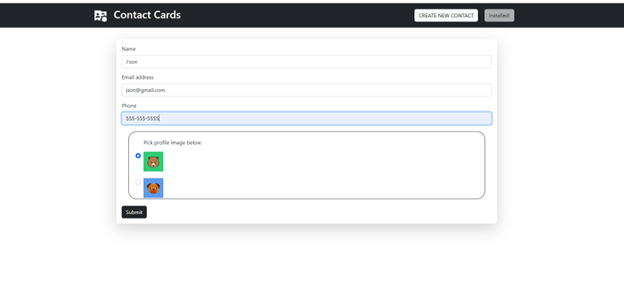
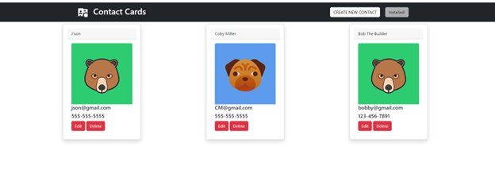
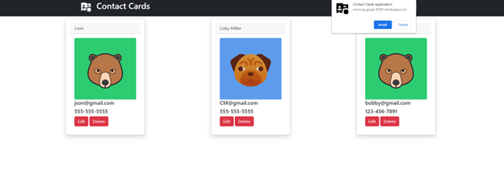
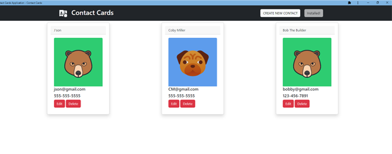

# contact-card

## Description
Contact Cards Application,  will allow users to store contact information and profile pics and add, edit, and delete information as needed in a convenient single-page application that can be used on any device. This application utilizes HTML, CSS, and JavaScript to be a Progressive Web Application, nodemon, IndexedDB, Manifest.json, webpack, asset bundler, Lighthouse(improve your app's speed and performance), concurrently, Heroku. 
 
This application is back-end application and runs throught Insomnia for testing the APIs.

## Table of Contents 
  * [Usage](#usage)
  * [Important-Links](#Important-Links)
  * [Questions](#questions)

   ## Usage 
  Used to connect with your friends and share your thoughts with other users and react to users thoughts and opinions. 
  * Firstly, open the terminal if deploying locally
  * "npm start" in root,  to start the server and then in your browser type `localhost:3001` to access the app.
  * Run in heroku local web, "npm start" in root, to start the server and then in your browser type `localhost:5000` to access the app.
  
  * Run on Heroku,once `localhost:3001` successfully running , Create folders and routes for User, Thoughts, Friends, Reactions. 

   

   
 
   
 
   

 ## Important Links 
* GitHub Link: https://github.com/MichaelZimm20/contact-card

* Heroku Link: https://morning-gorge-50381.herokuapp.com/

## Questions 
  If you have any questions or concerns, contact:
  * GitHub: [MichaelZimm20](https://github.com/MichaelZimm20)
  * Email: [m.zimm20@gmail.com](mailto:m.zimm20@gmail.com)
